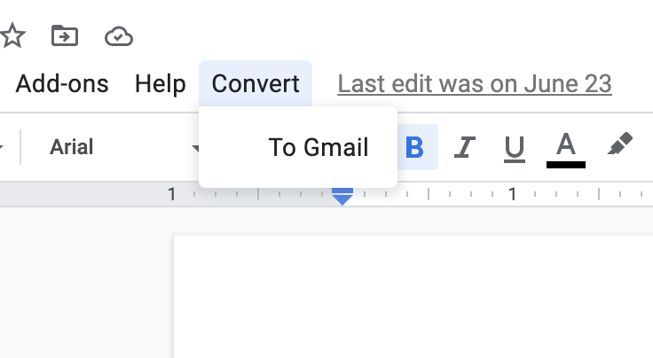

gdocs-to-gmail
==============
Allows people to collaborate on a newsletter in Gdocs and when done to generate clean HTML as though the contents had originally been edited in Gmail. We use this to help generate internal email communications.



The script adds a dropdown option to the GDocs top menu to run the conversion. When clicked, the 'To', 'Bcc' and 'Subject' fields are scraped, along with all the contents between the markers

```===CUSTOM_EMAIL_CONTENTS_BEGIN===```

... and ...

```===CUSTOM_EMAIL_CONTENTS_END===```


Only a specific subset of HTML conversion is supported, including paragraphs, bold, italic, links, a single title size, underline, newlines and bullet points. This helps keep a uniformity across the emails and ensure the contents display nicely across devices. The script converts the GDocs format into native Gmail HTML format, and then wraps in the pre-baked header and footer.

The resulting HTML is rendered to an alert box so it can be copied and pasted in a Gmail compose window's HTML source at a desired location. Any images are replaced with markers prompting the user to upload manually via the Gmail compose window interface to ensure they are correctly uploaded and ready for the email to send.

All of this together gives the benefit of enabling both the rich collaborative editing capabilities of GDocs, which everybody is used to, along with the crisp multi-device rendering nature of natively composed Gmail.